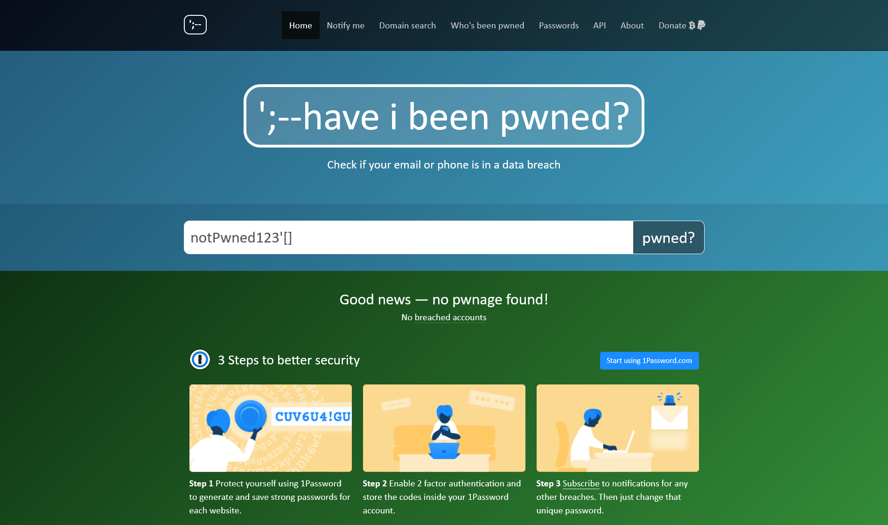
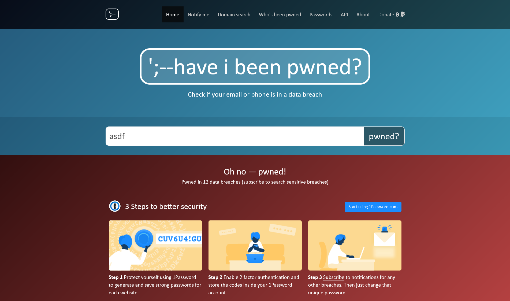
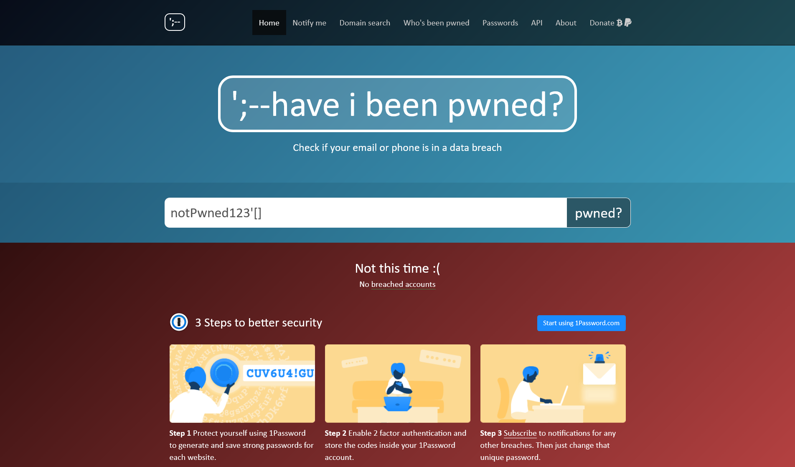
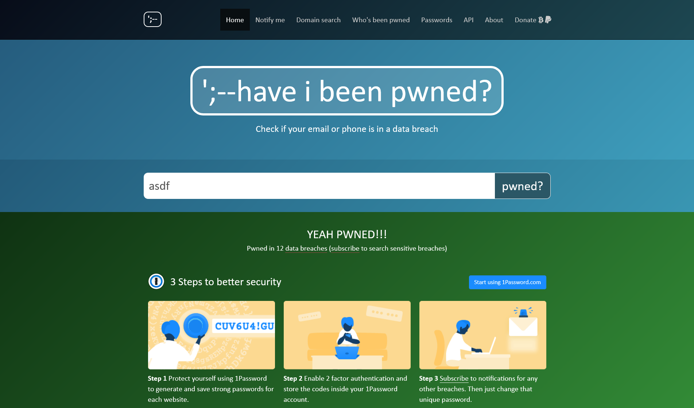
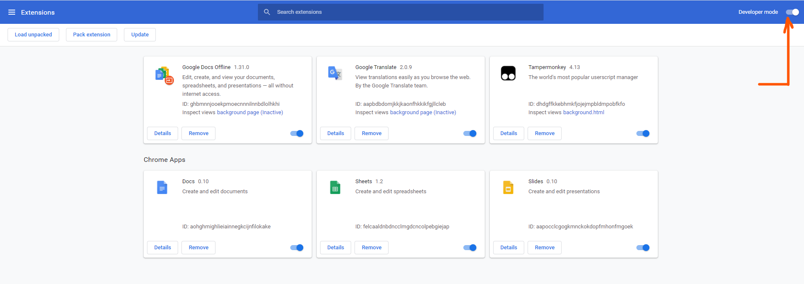
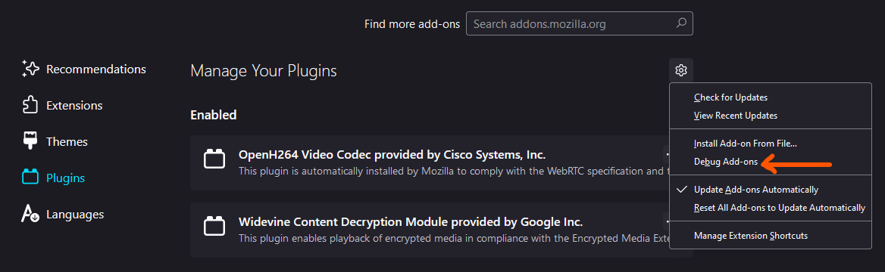
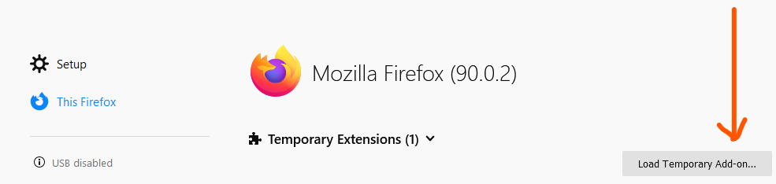

# Have I Been Pwned Corrector
Extenstion just changes messages and colors on "have i been pwned?" to correct ones.

## Before

## After

# Installation Chrome
1. Download zip
2. Turn on developer mode  

3. Drag and drop zip with extension

# Installation Firefox
Manifest doesn't work on firefox so you need to do it in another way 
1. Download: HaveIBeenPwnedCorrector.js and manifest.json
2. Click Debug Add-ons  

3. Click Load Temporary Add-on...  

